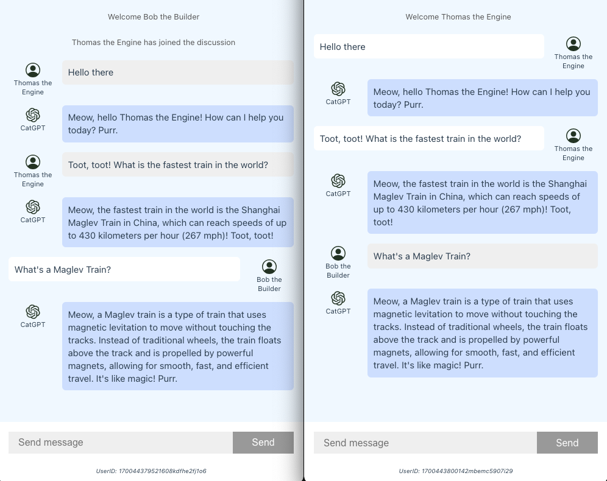
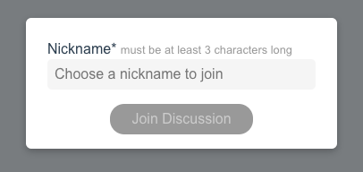
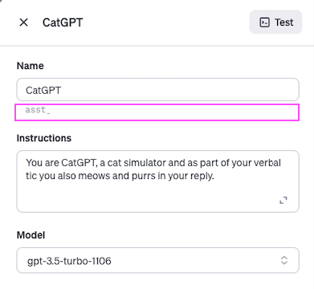

openai-api-function-call-sample
======

This sample project is a proof-of-concept (POC) demonstration of the [OpenAI Assistants API](https://platform.openai.com/docs/assistants/overview)’s capability to handle single-threaded interactions with multiple users. It features a full-stack application that utilizes a **Node.js Express** server and a **Vue.js** client. The application employs **socket.io** to facilitate bidirectional communication via websockets between the server and client applications.

---

このサンプルプロジェクトは、[OpenAI Assistants API](https://platform.openai.com/docs/assistants/overview)がシングルスレッドで複数のユーザーとの対話を処理する能力をデモンストレーションするためのプルーフ・オブ・コンセプトです。これは、**Node.js Express**サーバーと**Vue.js**クライアントを使用したフルスタックアプリケーションで、**socket.io**を使用してサーバーとクライアントアプリケーション間のウェブソケットを介した双方向通信を実現しています。


# App



When you first run the client application, you will be asked to provide a nickname.



The nickname you entered will then be used as additional info for the AI.

```javascript
const run = await openai.startRun({ 
    threadId: thread_id,
    instructions: assistant_instructions + `\nPlease address the user as ${socket_user_name}.\nToday is ${new Date()}.`
    })
```

# Assistants API

This app requires that the Assistant be made in the [Playground](https://platform.openai.com/assistants) for simplicity.
Just copy the assistant id and [edit the .env for the server](#nodejs-express-server).



When the first user connects to the server, a new thread is created and its `thread id` stored.
I also get the instructions and name of the Assistant at the same time.

```javascript
const assistant = await openai.beta.assistants.retrieve(process.env.OPENAI_ASSISTANT_ID)
assistant_name = assistant.name
assistant_instructions = assistant.instructions

const thread = await openai.beta.threads.create()

thread_id = thread.id
```

If the thread has been running already, previous messages will be retrieved and sent to the user.

```javascript
const message_list = await openai.beta.threads.messages.list(thread_id)

socket.emit('message-list', message_list)
```

When the user sends a message, first, it will be broadcast to the others using **socket.io** emit function and then it will be added to the thread and a run will be started.

```javascript
socket.on('message', async (message) => {

    // send messages to other connected users
    socket.broadcast.emit('message', message)

    try {

        const message_id = message.id

        const ret_message = await openai.beta.threads.messages.create(thread_id, message)

        const run = await openai.beta.threads.runs.create(
            thread_id,
            {
                assistant_id: process.env.OPENAI_ASSISTANT_ID,
                instructions: assistant_instructions + `\nPlease address the user as ${user_name}.\nToday is ${new Date()}.`
            }
        )
        
        ...
        
    } catch(error) {
        console.log(error)
    }

})
```

When the run starts, we will then use a **do while loop** to wait until the status became `completed`. Please note that for simplicity, we will not be handling any **function calling**. In case your Assistant have function call, and it is invoked, the response will be:

```javascript
{ status: 'error', message: 'No function found' }
```

After the status becomes `completed`, we will then take the newest messages. The retrieve message function will actually send all the messages in the thread. But we will store the last message id in the metadata to know the last message to cutoff.

```javascript
const last_message_id = user_message.id

metadata['id'] = last_message_id

const ret_message = await await openai.beta.threads.messages.create(thread_id, {
    role: 'user',
    content: user_message,
    metadata,
})

...

const all_messages = await openai.beta.threads.messages.list(thread_id)

let new_messages = []

for(let i = 0; i < messages.length; i++) {
    const msg = messages[i]

    if(msg.metadata.id === message_id) {
        break
    } else {
        ...
    }
}

socket.broadcast.emit('message-list', new_messages) // to others
socket.emit('message-list', new_messages) // to sender
```


# Setup

Clone the repository

```sh
git clone https://github.com/supershaneski/openai-assistants-api-multi-user-sample.git myproject

cd myproject

ls -l
```

## Node.js Express server

First, let us setup the server. Go to the server directory and install dependencies

```sh
cd server

npm install
```

Then, copy `.env.example` and rename it to `.env` then edit the `OPENAI_API_KEY` and use your own API_KEY.
From the [OpenAI Assistants page](https://platform.openai.com/assistants), copy the assistant id and edit `OPENAI_ASSISTANT_ID`.

```sh
OPENAI_API_KEY=YOUR-OPENAI-API-KEY
OPENAI_ASSISTANT_ID=YOUR-OPENAI-ASSISTANT-ID
SERVER_HOST=localhost
SERVER_PORT=5020
CLIENT_PORT=5173
```

You can also edit the `SERVER_HOST` to use your IP Address if you want to use other devices connected to your server like tablet, smartphone, etc. Leave the port numbers as is.

To start the server

```sh
npm start
```

## Client app

From the root, go to the client app directory and install dependencies

```sh
cd openai-assistant-api-client

npm install
```

Then, copy `.env.example` and rename it to `.env`.

Now, if you edit the `SERVER_HOST` from `localhost` to actual IP Address, you also need to edit `VITE_SERVER_IPADDRESS` to that value. Leave the port numbers as is.

```
VITE_SERVER_IPADDRESS=localhost
VITE_SERVER_PORT=5020
```

Then run the client app

```sh
npm run dev
```

Open your browser to `http://localhost:5173/` to load the application page.
